# React手机端商城

#### 项目介绍
React开发的手机端商城，使用antd-mobile UI框架

后台模拟用的是koa2，只模拟了取数据，不能修改数据

#### 项目预览

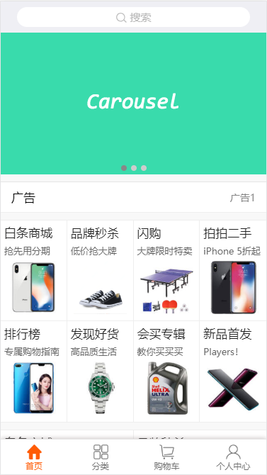
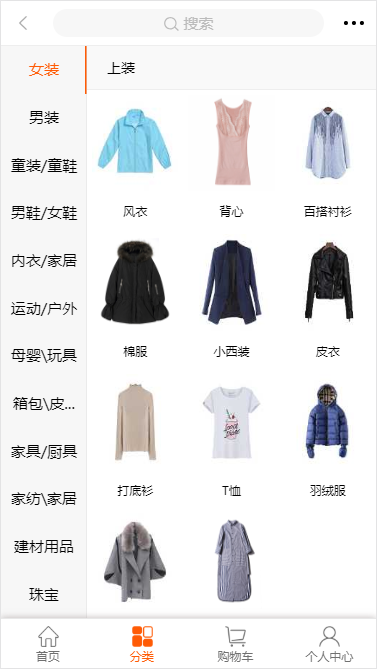
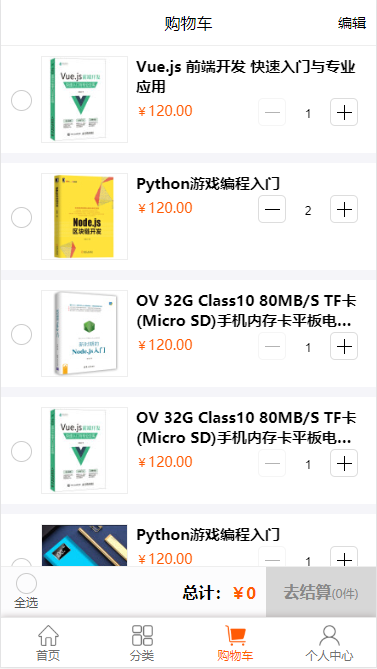
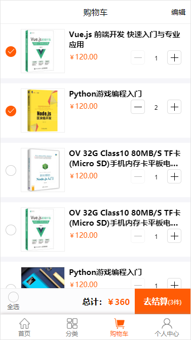
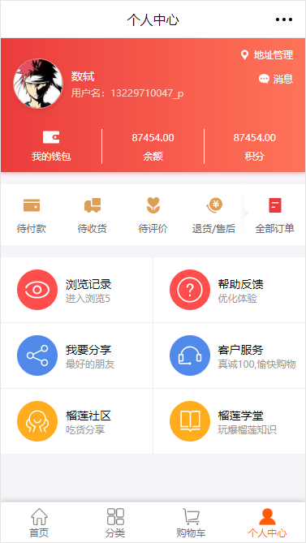
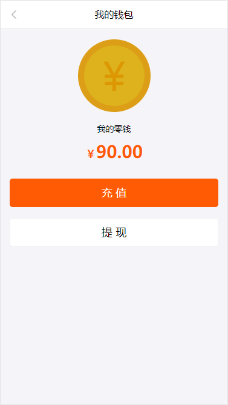
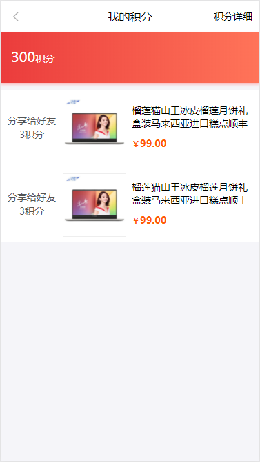
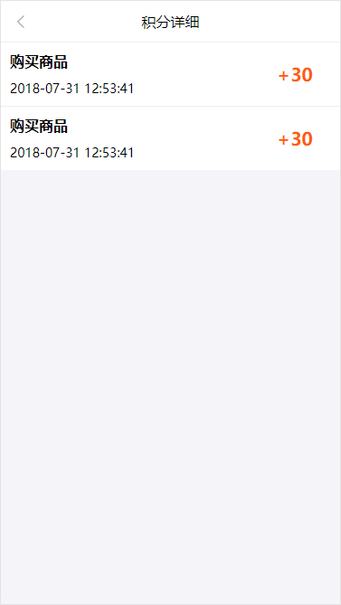
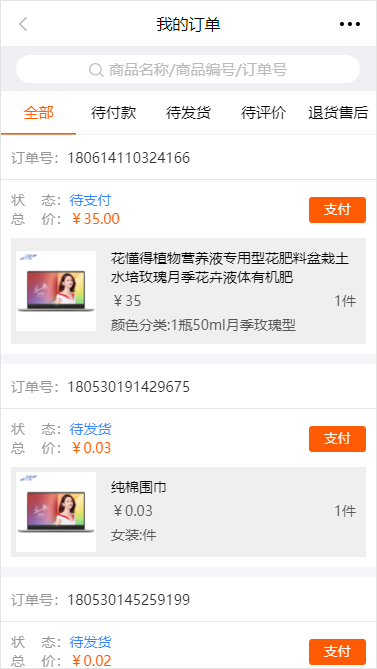
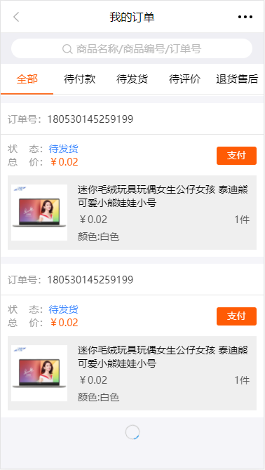
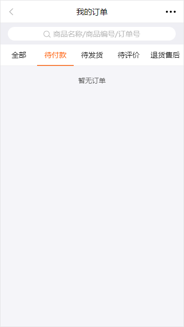
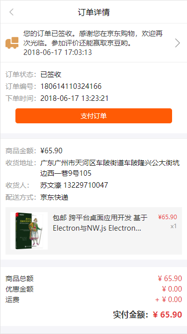
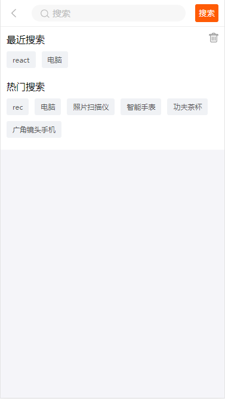
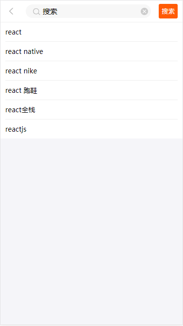
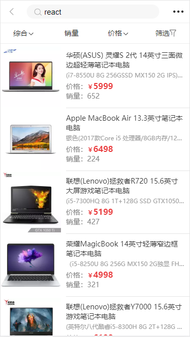
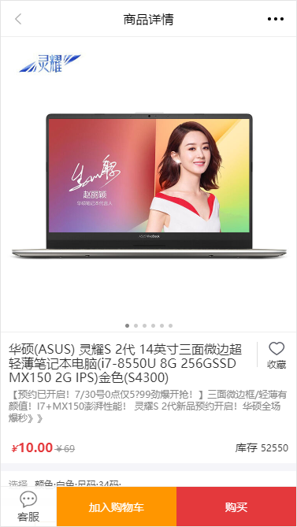
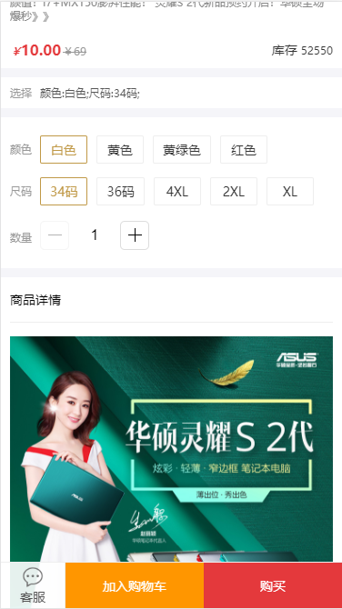
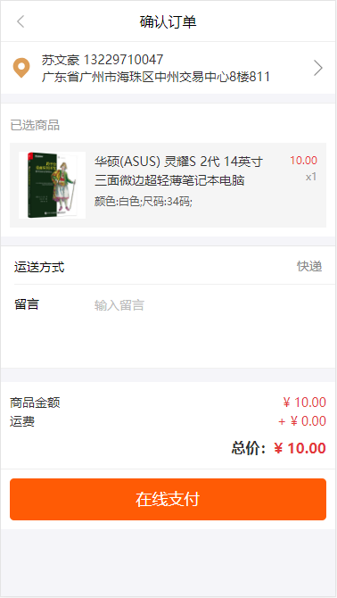
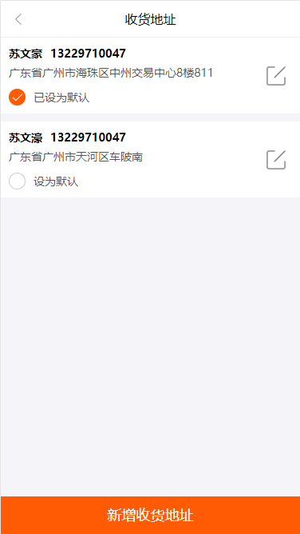
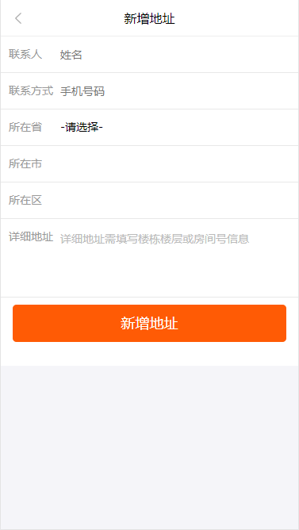
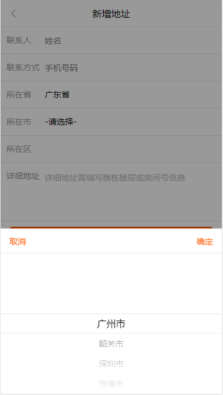
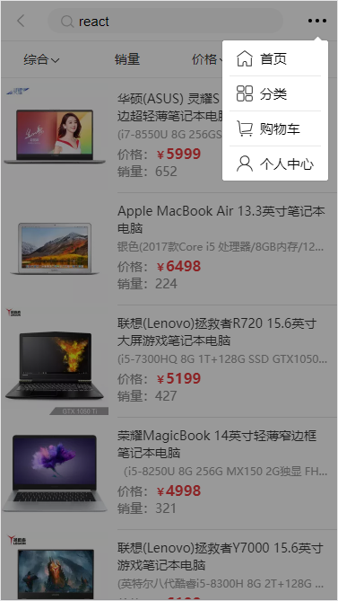
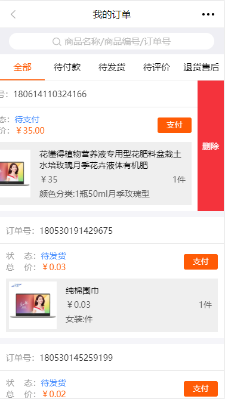
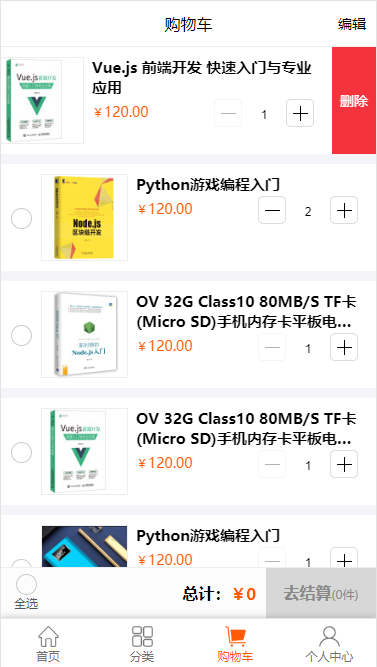
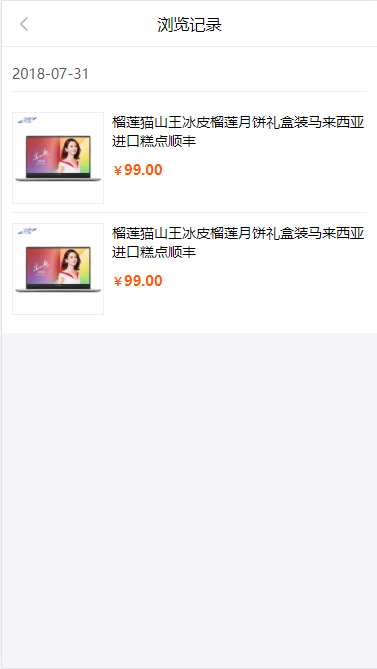
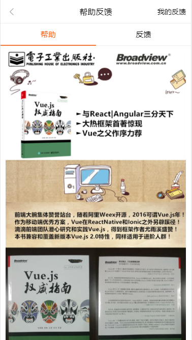
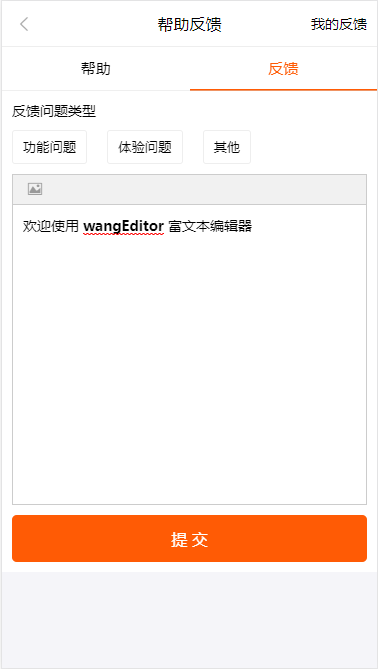
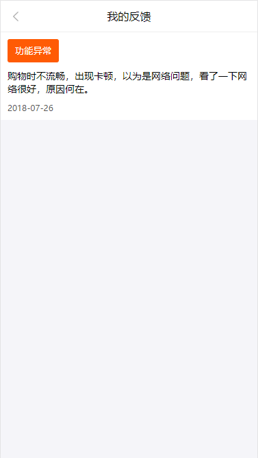
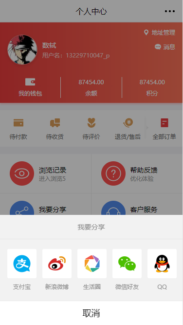


#### 软件架构
软件架构说明

- 后端
    - nodejs
- 前端
    - react,react-router,react-redux
- 数据库
    - 无
- 服务器
    - nodejs-koa2
- 使用技术细分
    - axios,react,react-router-dom,react-redux,redux,koa2,es6,es7[async-await],antd-mobile,underscore，jQuery等

#### 安装教程

1. 安装了node，并且node的版本>=node v7.6.0 ，或者node支持ES2015及更高版本和 async 方法 ,这里是为了支持koa2的环境
2. 使用 Babel 实现 Async 方法，要在 node < 7.6 版本的 Koa 中使用 async 方法,需要修改所有属于后端的js文件[不建议]。
    ```
    require('babel-register');
    // 应用的其余 require 需要被放到 hook 后面
    const app = require('./app');
    ```
3. 两个目录分别npm install 或者 yarn install [npm全局安装了yarn]
4. 然后在malladmin文件夹node app.js，在mallmobile文件夹npm start或者yarn start 
5. 打开网页
    http://localhost:3000/
6. 二次开发
    - 在mallmobile文件夹

